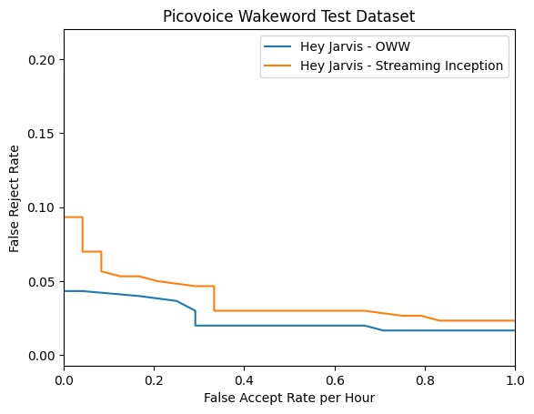

# On Device Wake Word Detection for ESPHome's Voice Assistant Component
This component implements wake word detection on the ESPHome device itself. It currently implements "Hey Jarvis" as the wake word, but any custom word/phrase is possible after training a new model. The ``micro_wake_word`` component starts the assist pipeline immediately after detecting the wake word without using Wyoming-openWakeWord.

It works well with comparable performance to openWakeWord. The detection latency is extremely low, nearly always faster than an ESP32 device using the openWakeWord pipeline.

Wake word detection is done entirely with [TensorFlow Lite Micro](https://github.com/espressif/esp-tflite-micro/). Wake word models are trained without using [Espressif's proprietary Skainet](https://github.com/espressif/esp-skainet) and can be customized without samples from different speakers. Sample preparation, generation, and augmentation heavily use code from [openWakeWord](https://github.com/dscripka/openWakeWord).

The target devices are ESP32-S3 based with external PSRAM. It may run on a regular ESP32 but may not perform as well.

**It is currently not trivial to train a new model. I am developing a custom training framework to make the process much easier!**

## YAML Configuration

See the [example YAML files](https://github.com/kahrendt/esphome-on-device-wake-word/tree/dev/example_esphome_yaml) for various S3 box models.

## Benchmarks

The following graph depicts the false-accept/false-reject rate for the "hey jarvis" model compared to the equivalent openWakeWord model.

Graph Credit: [dscripka](https://github.com/dscripka)

## Detection Process

The component detects the wake word in two stages. Raw audio data is processed into 40 features every 20 ms. Several of these features construct a spectrogram. A streaming inference model only uses the newest slice of feature data as input to detect the wake word. If the model consistently predicts the wake word over multiple windows, then the component starts the assist pipeline.

The first stage processes the raw monochannel audio data at a sample rate of 16 kHz via the [micro_speech preprocessor](https://github.com/tensorflow/tflite-micro/tree/main/tensorflow/lite/micro/examples/micro_speech). The preprocessor generates 40 features over 30 ms (the window duration) of audio data. The preprocessor generates these features every 20 ms (the stride duration), so the first 10 ms of audio data is part of the previous window. This process is similar to calculating a Mel spectrogram for the audio data, but it is lightweight for devices with limited processing power. See the linked TFLite Micro example for full details on how the audio is processed.

The streaming model performs inferences every 20 ms on the newest audio stride. The model is an [inceptional neural network](https://towardsdatascience.com/a-simple-guide-to-the-versions-of-the-inception-network-7fc52b863202?gi=6bc760f44aef) converted for streaming. It executes an inference in under 10 ms on an ESP32 S3, much faster than the 20 ms stride length. Streaming and training the model uses modified open-sourced code from [Google Research](https://github.com/google-research/google-research/tree/master/kws_streaming) found in the paper [Streaming Keyword Spotting on Mobile Devices](https://arxiv.org/pdf/2005.06720.pdf) by Rykabov, Kononenko, Subrahmanya, Visontai, and Laurenzo.

## Next Steps and Improvement Plans

  - Make the model training process more straightforward.
  - Generate and provide more pre-trained models.
  - Make it easy to switch between models in the YAML config.

## Model Training Process

We generate positive and negative samples using [openWakeWord](https://github.com/dscripka/openWakeWord), which relies on [Piper sample generator](https://github.com/rhasspy/piper-sample-generator). We also use openWakeWord's data tools to augment the positive and negative sample. In addition, we add other sources of negative data such as music or prerecorded background noise. Then, we train the two models using code from [Google Research](https://github.com/google-research/google-research/tree/master/kws_streaming). The streaming model is an inception neural network converted for streaming.

## Acknowledgements

I am very thankful for many people's support to help improve this! Thank you, in particular, to the following individuals and groups for providing feedback, collaboration, and developmental support:

  - [balloob](https://github.com/balloob)
  - [dscripka](https://github.com/dscripka)
  - [jesserockz](https://github.com/jesserockz)
  - [kbx81](https://github.com/kbx81)
  - [synesthesiam](https://github.com/synesthesiam)
  - [ESPHome](https://github.com/esphome)
  - [Nabu Casa](https://github.com/NabuCasa)